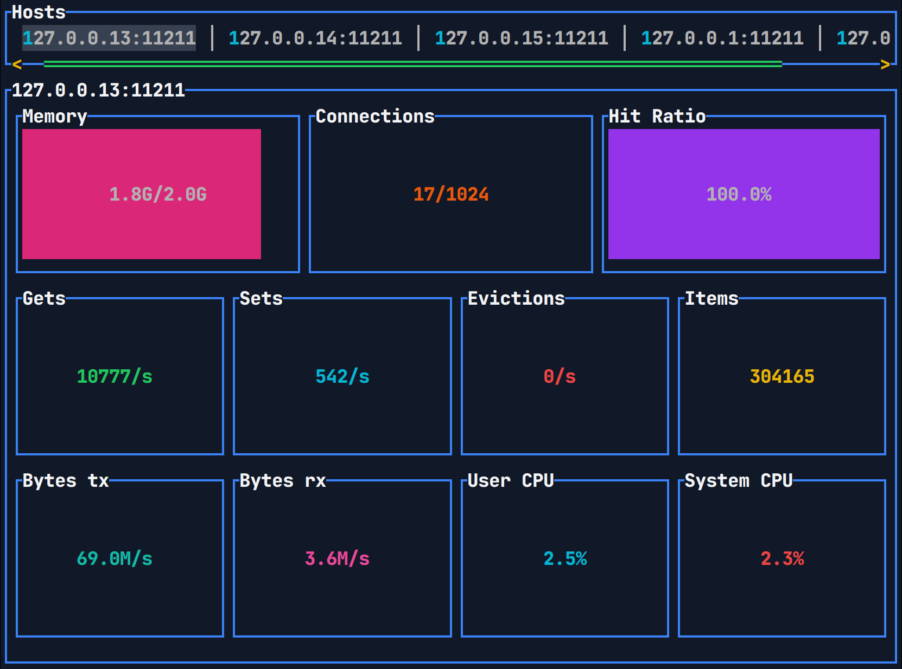

# mtop


[](https://docs.rs/mtop/)
[](https://crates.io/crates/mtop/)

mtop: `top` for Memcached.



## Features

* Display real-time statistics about your `memcached` servers such as
  * Memory usage/limit
  * Per-slab memory usage
  * Current/max connections
  * Hit ratio
  * Gets/Sets/Evictions
  * Bytes transmitted and received
  * Server CPU usage
* Support for easily switching between multiple servers

## Install

There are multiple ways to install `mtop` listed below.

### Binaries

Binaries are published for GNU/Linux (x86_64), Musl/Linux (x86_64), Windows (x86_64), and MacOS (x86_64 and aarch64)
for [each release](https://github.com/56quarters/mtop/releases). Each available archive contains the `mtop` and `mc`
binaries for that platform and a few documentation files.

### Docker

Docker images for GNU/Linux (amd64, arm64) are published for [each release](https://hub.docker.com/r/56quarters/mtop).
The docker images are built with the [Dockerfile](https://github.com/56quarters/mtop/blob/master/Dockerfile) in this
repository. They do not set an entrypoint and will run `mtop --help` by default. The `mtop` and `mc` binaries are
placed on the `PATH`, in `/usr/local/bin`.

### Cargo

`mtop` along with its dependencies can be downloaded and built from source using the
Rust `cargo` tool. Note that this requires you have a Rust toolchain installed.

To install:

```
cargo install mtop
```

To install as a completely static binary (Linux only):

```
cargo install --target x86_64-unknown-linux-musl mtop 
```

To uninstall:

```
cargo uninstall mtop
```

### Source

`mtop` along with its dependencies can be built from the latest sources on Github using
the Rust `cargo` tool. Note that this requires you have Git and a Rust toolchain installed.

Get the sources:

```
git clone https://github.com/56quarters/mtop.git && cd mtop
```

Install from local sources:

```
cargo install --path mtop
```

Install a completely static binary from local sources (Linux only):

```
cargo install --path mtop --target x86_64-unknown-linux-musl
```

To uninstall:

```
cargo uninstall mtop
```

## Usage

`mtop` takes one or more Memcached `host:port` combinations as arguments. Statistics from
each of these  servers will be collected approximately once a second. A maximum of ten
measurements from each server will be kept in memory to use for computations.

If `mtop` is not able to connect to the servers when starting, it will exit after printing
an error message. If `mtop` is not able to connect to servers or fetch statistics from
them _after_ starting, the errors will be logged to a file. The location of this file is
`/tmp/mtop/mtop.log` on Unix-like systems. This log file is truncated every time `mtop`
starts.

Some examples of invoking `mtop` are given below.

### Connecting to a local server
```
mtop localhost:11211
```

### Connecting to multiple servers

```
mtop cache01.example.com:11211 cache02.example.com:11211 cache03.example.com:11211
```

### Connecting to multiple servers with a single DNS name

#### A or AAAA

In this example, a DNS `A` lookup for `memcached.local` returns three DNS `A` records.

```
dig -t A memcached.local
;; QUESTION SECTION:
;memcached.local.         IN      A

;; ANSWER SECTION:
memcached.local.  0       IN      A       127.0.0.3
memcached.local.  0       IN      A       127.0.0.2
memcached.local.  0       IN      A       127.0.0.1
```

`mtop` will connect to all three servers: `127.0.0.1`, `127.0.0.2`, and `127.0.0.3`.

```
mtop dns+memcached.local:11211
```

#### SRV

In this example, a DNS `SRV` lookup for `_memcached._tcp.example.com` returns three DNS `SRV` records.

```
dig -t SRV _memcached._tcp.example.com
;; QUESTION SECTION:
;_memcached._tcp.example.com.        IN      SRV

;; ANSWER SECTION:
_memcached._tcp.example.com. 300 IN  SRV     100 100 11211 memcached01.example.com.
_memcached._tcp.example.com. 300 IN  SRV     100 100 11211 memcached02.example.com.
_memcached._tcp.example.com. 300 IN  SRV     100 100 11211 memcached03.example.com.
```

`mtop` will connect to all three servers, resolving their names to `A` or `AAAA` records
when connections are established: `memcached01.example.com.`, `memcached02.example.com.`,
and `memcached03.example.com.`. Note that the port number from the `SRV` records are ignored,
only the port from the command line argument is used.

```
mtop dnssrv+_memcached._tcp.example.com:11211
```

### Connecting to a port-forwarded Kubernetes pod

```
kubectl port-forward --namespace=example memcached-0 11211:11211
mtop localhost:11211
```

### TLS connection to server

```
mtop --tls-enabled cache01.example.com:11211
```

### TLS with a custom CA

```
mtop --tls-enabled --tls-ca memcached-ca-cert.pem cache01.example.com:11211
```

### TLS with client authentication and a custom CA

```
mtop --tls-enabled --tls-ca memcached-ca-cert.pem --tls-cert memcached-client-cert.pem --tls-key memcached-client-key.pem cache01.example.com:11211
```

### UI

Within the `mtop` UI, there are a few keys that control behavior.

* `q` to quit.
* `m` to toggle between the default UI and per-slab UI.
* `l` or `right-arrow` to select the next host.
* `h` or `left-arrow` to select the previous host.
* `j` or `down-arrow` to select the next slab row.
* `k` or `up-arrow` to select the previous slab row.

## Limitations

### No historical data

`mtop` displays instantaneous statistics or an average over the last 10 seconds (depending on
the particular statistic). It does not persist statistics anywhere for historical analysis. If
this is something you need, use the [memcached_exporter](https://github.com/prometheus/memcached_exporter)
for Prometheus.

## License

mtop is available under the terms of the [GPL, version 3](LICENSE).

### Contribution

Any contribution intentionally submitted  for inclusion in the work by you
shall be licensed as above, without any additional terms or conditions.

## Releasing

Steps for releasing new versions of `mtop` are described below.

* Open and merge a PR incrementing the version of `mtop` in all `Cargo.toml` files and update `CHANGELOG.md`.
* Update local `master` from Github remote. Make sure to build once with updated versions to update `Cargo.lock`.
* Create but do not push a tag of the format `v1.2.3`
* Run `cargo package` and `cargo publish` for the `mtop-client` crate.
* Run `cargo package` and `cargo publish` for the `mtop` crate.
* Push tags to all remotes `git push --tags origin`, `git push --tags github`
